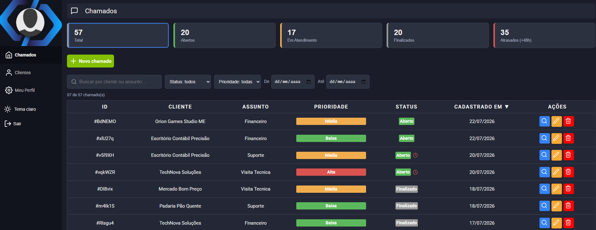

# Sistema de Chamados



## 📖 Sobre

**Sistema de Chamados** é uma aplicação web para gestão de tickets de suporte, desenvolvida com React e Vite. A plataforma permite cadastrar clientes (empresas), abrir e acompanhar chamados, registrar interações em uma timeline, alterar status e visualizar indicadores em um painel com gráficos.

Toda a persistência é feita no **Firebase** (Autenticação, Firestore e Storage), com atualização **em tempo real**: mudanças feitas em uma tela refletem automaticamente nas demais, sem precisar recarregar a página. O projeto conta com tema claro/escuro, layout responsivo e uma arquitetura organizada em camada de serviços, hooks e componentes.

---

## ✨ Funcionalidades

- 🔐 **Autenticação**
  - Cadastro, login e logout com e-mail e senha (Firebase Auth).
  - Sessão persistida (UI instantânea via `localStorage` + Firebase como fonte de verdade).
  - Mensagens de erro traduzidas e amigáveis (e-mail já em uso, senha fraca, credenciais inválidas, etc.).

- 🏢 **Clientes (Empresas)**
  - Cadastro, edição e exclusão de empresas.
  - Máscara e **validação de CNPJ** pelos dígitos verificadores oficiais.
  - Busca por nome ou CNPJ (com debounce), ordenação por coluna e paginação.
  - Contagem de chamados por cliente (total e em aberto) e bloqueio de exclusão de clientes com chamados vinculados.

- 🎫 **Chamados**
  - Abertura, edição e exclusão de chamados vinculados a um cliente.
  - Atualização **em tempo real** (Firestore `onSnapshot`).
  - Assunto, prioridade (Baixa/Média/Alta) e status (Aberto/Em Atendimento/Finalizado).
  - **SLA**: chamados não finalizados abertos há mais de 48h são marcados como atrasados.

- 🔎 **Filtros na URL**
  - Filtre por busca, status, prioridade, período (data inicial/final), cliente e "somente atrasados".
  - Os filtros ficam na URL (`/chamados?status=Aberto&cliente=...`): o link é compartilhável, o F5 preserva a seleção e o botão de voltar desfaz a escolha.
  - Cards de indicadores clicáveis e chip de filtro removível.

- 🕓 **Timeline de Interações**
  - Cada chamado tem um histórico em tempo real: abertura, mudanças de status e comentários.
  - Registro automático de quem alterou o status e quando.

- 📊 **Painel e Gráficos**
  - Gráfico de barras (chamados por dia nos últimos 14 dias, por status).
  - Gráfico de rosca (distribuição por prioridade).
  - KPI de **tempo médio de resolução** dos chamados finalizados.

- 👤 **Perfil**
  - Edição de nome e **upload de avatar** (Firebase Storage) com barra de progresso.
  - Troca de senha e exclusão de conta (com reautenticação por segurança).
  - Informações da conta (membro desde, último acesso).

- 🌗 **Tema Claro/Escuro**
  - Alternância de tema persistida no navegador e sincronizada no perfil do usuário.

- 📱 **Experiência Responsiva**
  - Layout adaptado para desktop e mobile, com sidebar colapsável e skeletons de carregamento.

---

## 🚀 Tecnologias Utilizadas

- **[React 17](https://react.dev/)**: Biblioteca para construção da interface de usuário.
- **[Vite 5](https://vitejs.dev/)**: Ferramenta de build e servidor de desenvolvimento.
- **[Firebase 12](https://firebase.google.com/)** (SDK modular): Autenticação, Firestore e Storage.
- **[React Router DOM 5](https://v5.reactrouter.com/)**: Roteamento e rotas privadas.
- **[Recharts](https://recharts.org/)**: Gráficos do painel de indicadores.
- **[React Toastify](https://fkhadra.github.io/react-toastify/)**: Notificações (toasts).
- **[date-fns](https://date-fns.org/)**: Formatação e manipulação de datas.
- **[React Icons](https://react-icons.github.io/react-icons/)**: Ícones da interface.
- **[Vitest](https://vitest.dev/)** + **[Testing Library](https://testing-library.com/)**: Testes unitários e de componentes.

---

## ⚙️ Como Executar o Projeto

Siga os passos abaixo para rodar o projeto em seu ambiente de desenvolvimento.

### Pré-requisitos

- [Node.js](https://nodejs.org/en) (versão 18 ou superior)
- [npm](https://www.npmjs.com/)
- Um projeto no [Firebase](https://console.firebase.google.com/) com **Authentication** (e-mail/senha), **Firestore** e **Storage** habilitados.

### Passos

1. **Clone o repositório:**
   ```bash
   git clone https://github.com/rodrisoares/sistema-chamados.git
   ```

2. **Acesse o diretório do projeto:**
   ```bash
   cd sistema-chamados
   ```

3. **Instale as dependências:**
   ```bash
   npm install
   ```

4. **Configure as variáveis de ambiente:**

   Copie o arquivo de exemplo e preencha com as credenciais do seu projeto Firebase
   (Console do Firebase → Configurações do projeto → Seus apps):
   ```bash
   cp .env.example .env
   ```
   ```env
   VITE_FIREBASE_API_KEY=...
   VITE_FIREBASE_AUTH_DOMAIN=...
   VITE_FIREBASE_PROJECT_ID=...
   VITE_FIREBASE_STORAGE_BUCKET=...
   VITE_FIREBASE_MESSAGING_SENDER_ID=...
   VITE_FIREBASE_APP_ID=...
   VITE_FIREBASE_MEASUREMENT_ID=...
   ```
   > As variáveis precisam do prefixo `VITE_` e são lidas via `import.meta.env`. Reinicie o servidor após alterá-las.

5. **Execute a aplicação:**
   ```bash
   npm start
   ```

A aplicação estará disponível em `http://localhost:3000`.

---

## 📜 Scripts

| Script             | O que faz                                       |
| ------------------ | ----------------------------------------------- |
| `npm start`        | Servidor de desenvolvimento (Vite)              |
| `npm run build`    | Build de produção                               |
| `npm run preview`  | Serve o build de produção localmente            |
| `npm test`         | Testes em modo watch (Vitest)                   |
| `npm run test:run` | Executa os testes uma vez (CI)                  |

---

## 🗂️ Estrutura do Projeto

```
src/
├── assets/         # Imagens (logo, avatar, capa)
├── components/     # Componentes reutilizáveis (Header, ErrorBoundary, modais...)
├── contexts/       # Contexto de autenticação
├── hooks/          # Custom hooks (useChamados, useCustomers, useDebounce...)
├── pages/          # Telas (Chamados, Detail, Customers, Profile, SignIn...)
├── routes/         # Configuração de rotas e rota privada
├── services/       # Camada de acesso ao Firebase (auth, chamados, customers, storage)
└── utils/          # Funções utilitárias (cnpj, status, logError)
```

A comunicação com o Firebase é isolada na pasta `services/` — as telas nunca chamam o SDK diretamente, consumindo os serviços através de custom hooks.
